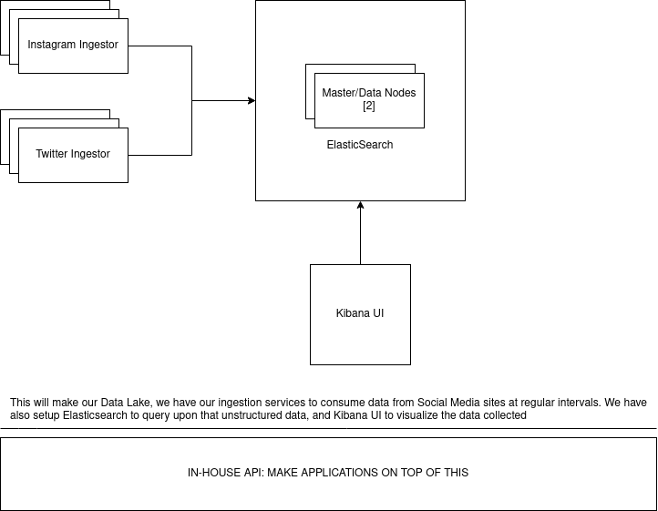
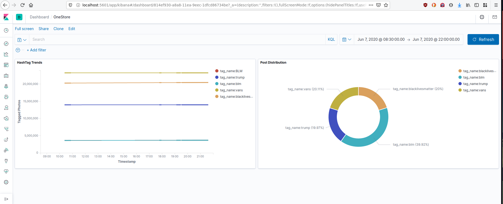
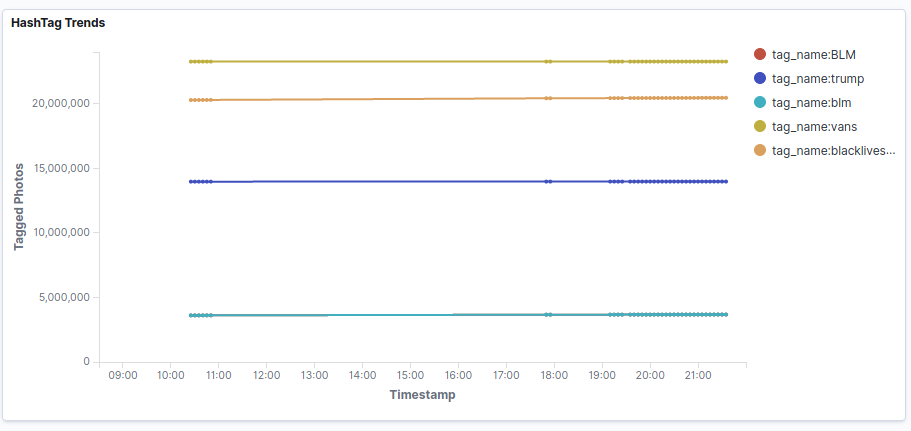
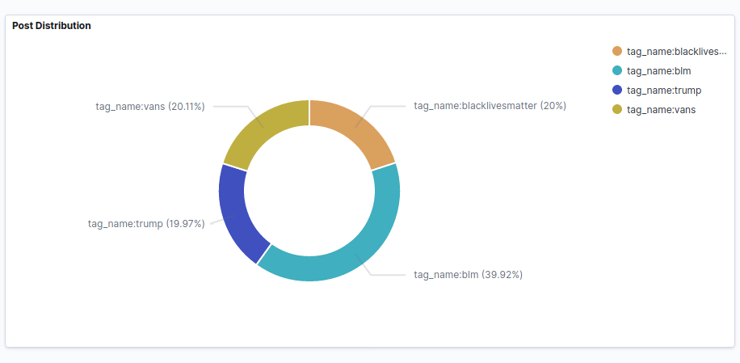

### ONESTORE

For building a platform targeted towards social meda audiences, we need
to ingest data from all social media services-- likes of instagram, tiktok,
twitter etc.

Since we are not in control of how the data is generated, we cannot rely
on a solid schema, instead we'll need something more flexible to make
sense of this unstructured data. There are a couple of free open source
software that can help us in doing that. Why not leverage that?

### ARCHITECTURE

INGESTION SERVICE: Ingestor services written in golang-- because of goroutines,
using python will induce a lot of unwanted latecny and golang is more efficient
when it comes down to memory consumption.

This ingestion service will scrape data for given tags at regular intervals, we'll
use instagram's public API to not run into rate limiting issues. We can hit this
particular url as many times as we want: https://www.instagram.com/explore/tags/vans/?__a=1

This follows a particular pattern-- https://www.instagram.com/explore/tags/{tag}/?__a=1
We can add any tag here and get related tags, post count, popular posts tagged,
their isntagram url, number of comments etc and put it into ElasticSearch.

In the given repository, I've done it for tags, public user profile can be
scraped without limit as well using: https://www.instagram.com/vans/?__a=1.

This also follows the form https://www.instagram.com/{insta_handle}/?__a=1 and
we can scrape away. What information does this api provide? Related profiles,
follower count, media, likes etc.

However if needs arise, and problems do occur, and we have to resort to using
Instagram's Public API we can use multiple developer account with rotation,
using twenty accounts with rotation will allow us to scrap for content every
second. Number of accounts will depend on how often do we want to scrape for
the data.

> 20 accounts \* 200 requests = 4000 requests/hour = 1.11 requests/s



And to get Data out of our Data Lake, we'll provide with an API. This API
can be now used to make client facing apps which want the insights from the
data we have collected. To make sure our API is available and is able to
handle traffic at scale, we can use a Load Balancer to distribute the
traffic among our Nodes.

Say you want to track Nike's add campaign, we tell our API to track posts
tagged with Nike, from the given date. We now have started to record
historical data, and if the campaign lasts for a week, we can tell, how
many images/tweets were posted on social media sites, how many users
were engaged, comments, likes etc from our Data Lake.

All we need is client side application which can easily be written with
PostgreSQL/MongoDB and web framework to provide with User Authentication,
Authorization and interaction with our Data Lake for the end user.

What insights can we obtain from our Data Lake?

- Rank influencers
- Competitor analysis
- Sentiment analysis of hashtags around a brand
- Which posts spike engagements-- by comment count, comment analysis
- Historical engagement and analysis, before a campaign begins and after it
  concludes

### RUNNING THE PROJECT

Make sure you have `docker` and `docker-compose` installed on your system.

```bash
$ docker-compose up
```



Head over to http://localhost:5601/app/kibana, and you'll be greeted with
the Kibana UI, now you can add visualizations to analyze the data ingested
by our Data Lake.

From the data that I was able to collect for 6 hours, I made two graphs.
One is a LineChart which the tracks number of posts for a paricular tag.
The change in the incline is minute and not prominent, because the data
aggregation process lasted for a short duration of time. But if you look
closely, you can see that the hashtag #blacklivesmatter shows an upward
incline.

The other is a pie chat, which can be used for competitive analysis. In this
chart we see the percentage of share enjoyed by each hashtag during the time
we collected our data.




